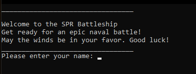
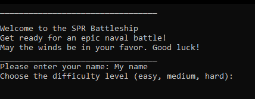
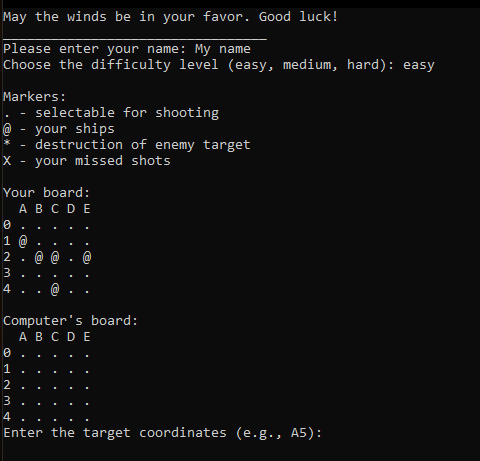
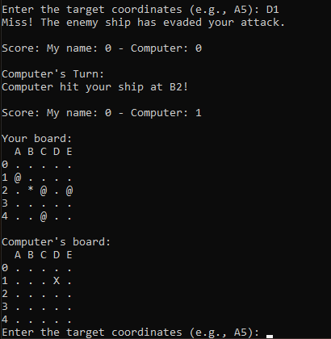
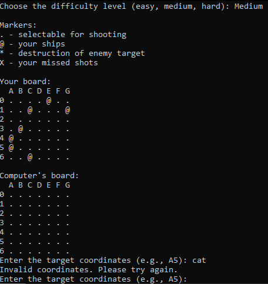
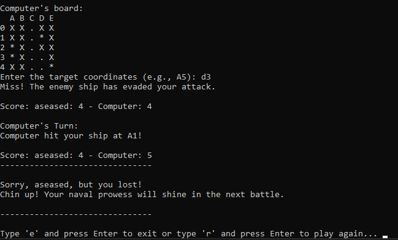
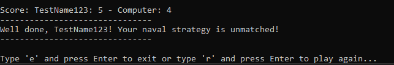
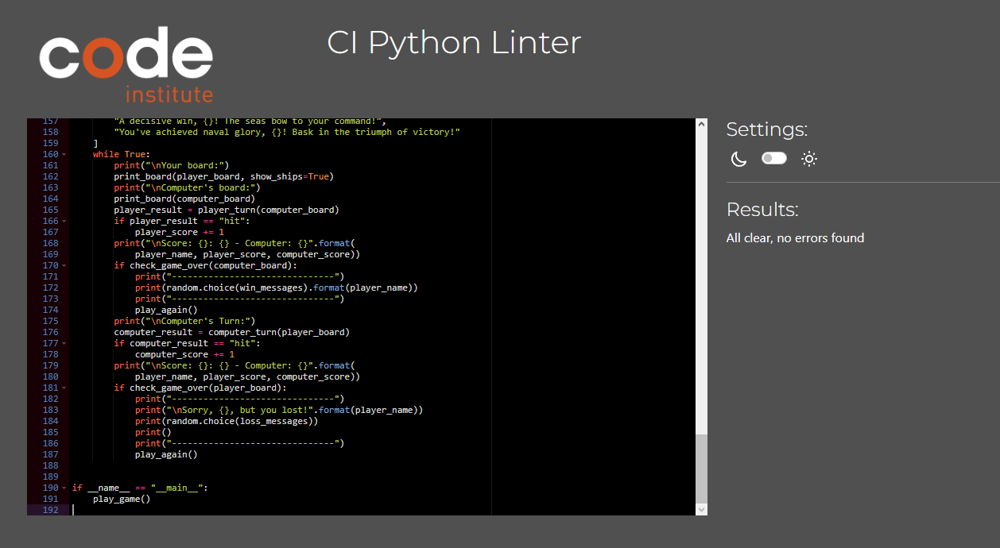
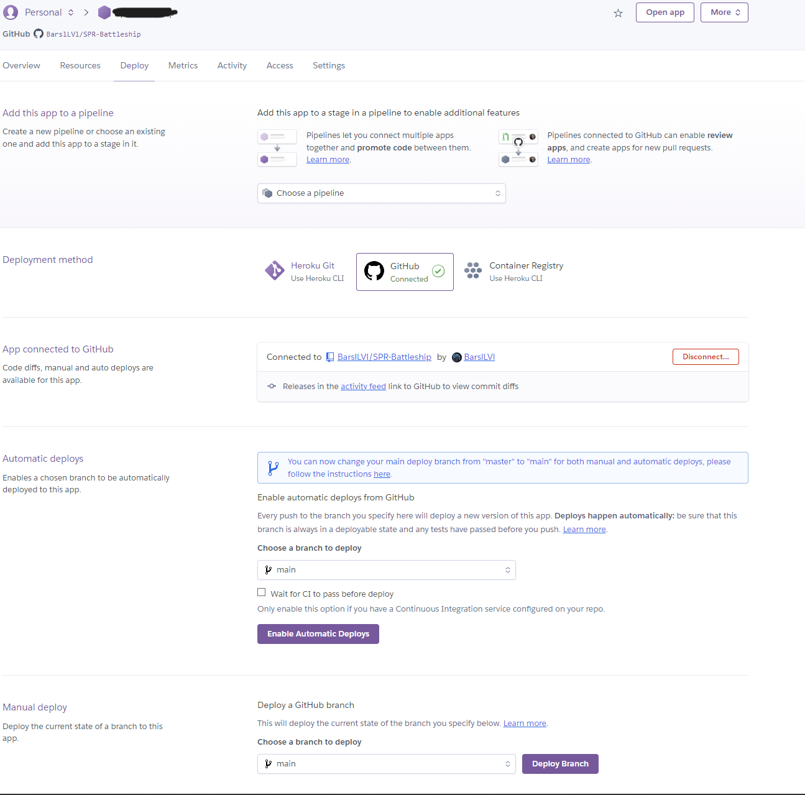

# SPR Battleship
SPR Battleship is a Python terminal game, which runs in the Code Institute mock terminal on Heroku.
Users can try to beat the computer by finding all of the computer's battleships before the computer finds theirs. Each battleship occupies one square on the board.

## How to play
SPR Battleship is a modern adaptation of the classic pen-and-paper game. In this version, players start by entering their names, and two boards are randomly generated one for the player and one for the computer.

On the player's board, the locations of their ships are marked with "@", while the computer's ship locations remain hidden. The grid comprises empty cells denoted by ".", which player can use for their guesses. The computer may also target these cells on the player's board.

When either player makes a guess, a marked "X" indicates a miss, and an "*" denotes a successful hit on an opponent's ship. The game unfolds as both the player and the computer take turns making guesses, aiming to sink each other's battleships.

The ultimate victor is the player or computer who successfully sinks all of their opponent's battleships first.

## Features
### Existing features
- Player name / difficulty level
    - Player name can be entered
    - The player can choose any difficulty level (easy, medium, hard). The main thing to remember is that the size of the playing area depends on the choice of level, the maximum board size is 10 (on hard difficulty)

- Random board generation
    - Ships are randomly generated on the both boards
    - The number of ships is determined by the difficulty level
    - The size of the board is determined by the difficulty level
    - The player cannot see where the computer's ships are
    

- Play against the computer
- Accepts user input
- Maintains scores
- Input validation and error-checking
    - The user can enter only letters and numbers
    - You cannot enter coordinates outside the size of the grid
    - You can't choose the same coordinate twice

- Final table
    - Shows the player's and computer's scores
    - Depending on who won, a message and quote are shown at the end if the player lost to the computer or won to the computer. There are 10 quotes if the player wins or loses (that is, you can see 10 different quotes if you win, and 10 different ones if you lose)
    - At the end, the player can choose to close the game or play again

### Future Features
- Add a difficulty level called "custom"(Which means that the player can choose where the ships will be located, as well as their ship sizes, which can be more than 1x1)
- Add the ability to end the game while playing

## Bugs
- After selecting the difficulty level, the game closed
- After selecting the difficulty, the playing area was out of bounds.
- The computer did not select a cell to hit after my choice.
- The system could not determine when the game ended, and the game continued even after all the cells were used and all the ships were destroyed.
- The game code was too large for PEP8, and there were also a lot of extra spaces.
- Markers were displayed incorrectly (what the player’s ship looks like, a hit and miss marker)
### Remaining Bugs
- No bugs remaining

## Testing
I have tested my python code by [CI Python Linter](https://pep8ci.herokuapp.com/#)

Also I tested in my local terminal. I tried to check using the Code Institute Herkou terminal, uploaded my project, but it shows an error when opening the application, which I don’t know how to solve, looking at the logs I don’t understand exactly what the error is.

## Deployment
This project was deployed using Code Institute's mock terminal for Heroku.

This should be a link to my application in the online [MY LINK](https://sp3battleship-1e569b033394.herokuapp.com). But it doesn’t work correctly, there is some error that I don’t understand, when I look at the logs I still don’t understand it.

The steps for deployment are as follows:

- Fork or clone this repository
- Create a new Heroku app
- Set the buildpacks to Python and NodeJS in that order
- Link the Heroku app to the repository
- Click on Deploy

## Credits
I found the following sources of help when trying to implement my project.
- [Youtube video 1](https://www.youtube.com/watch?v=9-260xX05kY)
- [Youtube video 2](https://www.youtube.com/watch?v=Gi0Fdyhk1_0&ab_channel=RobertHeaton)
- [Youtube video 3](https://www.youtube.com/watch?v=xz9GrOwQ_5E&ab_channel=KnowledgeMavens)
- [w3scools python](https://www.w3schools.com/python/)
